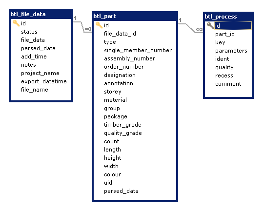

# d3btl


## What is BTL
 - BTL can be used by every design software and every machine, because it's a free standard.
 - BTL includes a complete description of the format and all processings.
 - BTL describes parts in a machine independent geometry format.
 - BTL files can be viewed and checked with our free BTL viewer.

## Features

Yii2 module. 
Reads BTL files created by design2machine interface and save in DB.

Realised interpreting:
 - raw part
 - part
 - processes
    - Lap size and open sides

BTL format documentation https://design2machine.com/btl/btl_v106.pdf 


## Installation

The preferred way to install this extension is through [composer](http://getcomposer.org/download/).

Either run

```
$ composer require d3yii2/d3btl "*"
```

or add

```
"d3yii2/d3btl": "*"
```

to the `require` section of your `composer.json` file.


add to migration path

```php

'class' => 'yii\console\controllers\MigrateController',
'migrationPath' => [
                    '@d3yii2/d3btl/migrations',
]
```

add to modules
```php
  'modules' => [
        'btl' => [
            'class' => 'd3yii2\d3btl\Module'
        ],
  ]        
```

## Usage

command add, reads files and saves their data in database

```bash

php btl/process-file/add path/to/file

```

Add file by code
```php
        $model = new BtlFileData();
        $model->load(['file_data' => $fileText, 'file_name' => $filename], '');
        $model->saveWithParts();

```

Get data
 ```php
 $btl = BtlFileData::findOne($btlId);
 $btlPartRaw = $btl->getBtlParts()->andWhere(['type' => BtlPart::TYPE_RAWPART])->all();
 $btlPartOut = $btl->getBtlParts()->andWhere(['type' => BtlPart::TYPE_PART])->all();
 
 foreach($btlPartRaw as $pr) {
    echo $pr->getHeight() . ' ' . $pr->getWidth() . ' ' . $pr->getLength();
 }
 
  foreach ($btlPartOut as $po) {
    foreach ($po->btlProcesses as $process) {
      if (!$lap = $process->getLap()) {
            continue;
        }

        /** bottom is open */
        if (!$lap->isP04bit5()) {
            continue;
        }

        /** top is open */
        if (!$lap->isP04bit6()) {
            continue;
        }

        $m3 = ($lap->P12/100)/1000
            * ($lap->P14/100)/1000
            * $height/1000;
        echo $m3;    
     }       
 }
 
 ```


## DB


